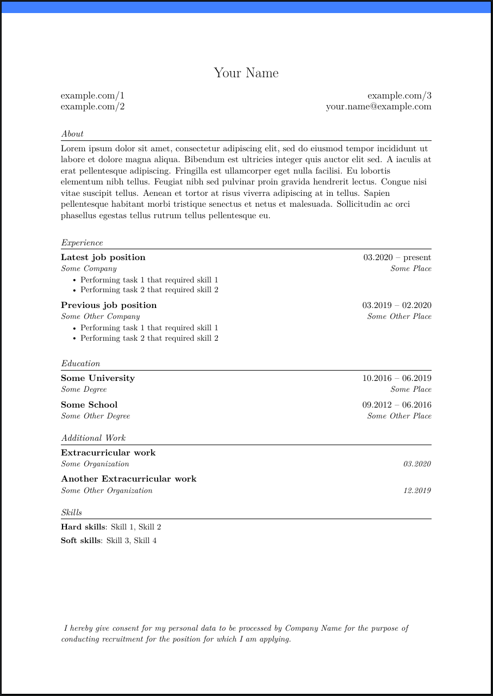

# Resume Generator LaTeX
A tool for generating a classic style resume from metadata, templated in LaTeX.

## Example

An example YAML can be found in [example/example.yaml](./example/example.yaml).
The command:

```sh
cat example/example.yaml | ./resumegen example/example.pdf
```

generates [example/example.pdf](./example/example.pdf),
which looks like this:



## Prerequisites

- Go
- Make
- TeXLive (with latexmk)

## Run

```sh
make build
cat <input_file.yaml> | ./resumegen <output_file.pdf>
```

## Combining inputs

You can have structured files for different kinds of resumes,
like:

```sh
cat base.yaml company1.yaml backend.yaml | ./resumegen your_name_company1_backend.pdf
```

## Schema validation

No fields in `Resume` are required,
because data can be spread through different YAML files.
Schema validation should work out of the box in IntelliJ.
In VSCode, you have to install a recommended extension for YAML.
